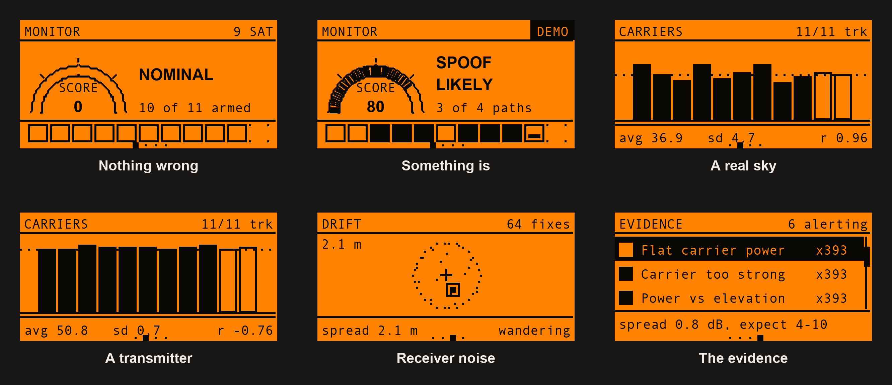
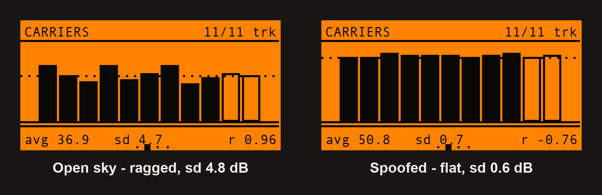
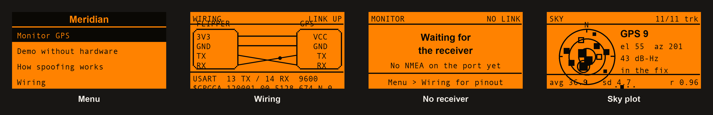
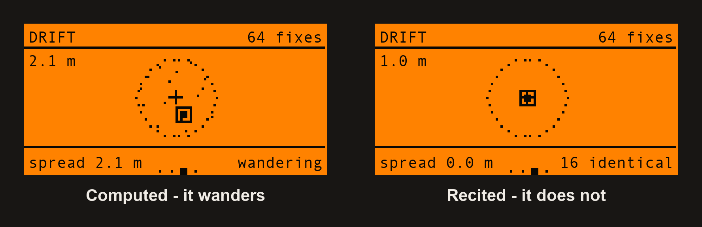
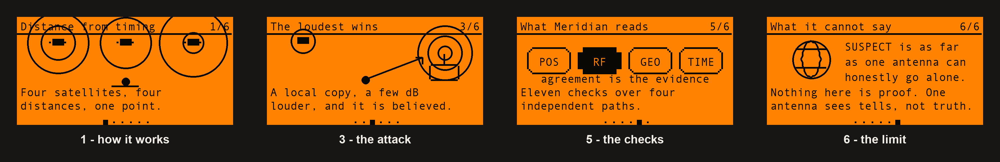
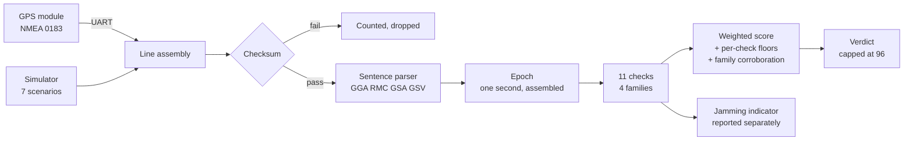

<div align="center">


# Meridian

**Is anything lying to you about where you are?**

Civil GPS arrives below the noise floor, unencrypted and unsigned. Anything that transmits the same structure a few decibels louder is believed — completely, silently, and with full confidence. Meridian is the tool that notices.

[](https://github.com/at0m-b0mb/Meridian-FlipperZero/actions/workflows/build.yml)


-8a2be2)


</div>

---

## The problem nobody designed out

The GPS signal your phone, your car and half the world's infrastructure depends on was specified in 1973 and has never been authenticated. The civil L1 C/A signal is:

- **public** — the code for every satellite is in a published standard,
- **unsigned** — nothing in the message proves who sent it,
- **and faint.** It reaches the ground at roughly **−130 dBm**, which is *below the thermal noise floor*. Your receiver only finds it by correlating against a code it already knows.

The consequence is not subtle. A transmitter that produces the same structure a few decibels louder does not have to break anything. The receiver simply prefers it, locks onto it, and goes on reporting a confident position and a confident time — with no error, no warning, and no field anywhere in NMEA that says "by the way, this might not be real."

Software-defined radios capable of generating that signal cost less than the phone in your pocket.

**Meridian is the tool that watches for the tells.**

<div align="center">



*Nothing wrong · something is · a real sky · a transmitter · receiver noise · the evidence*

</div>

---

## The one picture that matters

Every satellite in a real sky arrives at a different power. Ones near the horizon punch through more atmosphere and more ground clutter and come in weak; ones overhead come in strong. The spread across a live constellation is **four to ten decibels**, and power **rises with elevation**.

A spoofer is one transmitter, with one power amplifier, sitting at one point on the ground. Every fake satellite it generates arrives at nearly the same level — and if anything the relationship with elevation *inverts*, because the source is down near the horizon rather than spread across the sky.

<div align="center">



</div>

You do not have to read the standard deviation underneath. The shape tells you.

---

## What it actually does

- **Reads NMEA 0183** from any GPS module on the Flipper's GPIO header — GGA, RMC, GSA, GSV, GLL, VTG, across GPS, GLONASS, Galileo and BeiDou.
- **Runs eleven integrity checks** every second, across four independent measurement paths.
- **Scores the disagreement** and gives a verdict, with the observed number and the expected range beside every finding.
- **Names the innocent explanation** for every check, on the same screen as the accusation.
- **Reports jamming separately**, because denial and deception are different attacks.
- **Works with no hardware at all** — a built-in simulator drives the real detector through seven scenarios.

It never transmits. There is no TX path compiled into the application.

---

## The eleven checks

| Check | Path | What a real sky does |
|---|:---:|---|
| **Impossible motion** | Position | Consecutive fixes imply a ground speed no vehicle reaches |
| **Speed mismatch** | Position | Doppler speed and position-derived speed are computed independently, so they agree |
| **Position frozen** | Position | Even bolted down, a fix wanders a metre or two per second |
| **Altitude anomaly** | Position | Height does not step hundreds of metres between seconds, or pin to exactly zero |
| **Lock captured** | Position | A fix that returns after an outage does not imply 800 m/s across the gap |
| **Flat carrier power** | Carrier | C/N0 spreads 4–10 dB across a live constellation |
| **Carrier too strong** | Carrier | A patch antenna peaks near 48–50 dB-Hz; a *mean* above 50 is not open sky |
| **Power vs elevation** | Carrier | Power climbs with elevation — r is typically +0.4 to +0.8 |
| **Sky not moving** | Geometry | Satellites rise and set; over four minutes, elevations change |
| **Accuracy implausible** | Geometry | HDOP follows from geometry, so it moves as the sky does |
| **Clock inconsistent** | Time | GPS time advances at one second per second against the Flipper's own clock |

Each threshold and the physical claim behind it is documented in **[SPOOFING.md](SPOOFING.md)**.

---

## How it decides — and where it stops

This is the part most detectors get wrong, so it is worth being explicit.

**Corroboration is counted in families, not checks.** The three carrier checks all read the same C/N0 numbers, so three of them firing together is *one observation restated*, not three. Only agreement between the four independent paths — position, carrier, geometry, time — raises confidence.

| Families alerting | Verdict reachable |
|:---:|---|
| 0 | NOMINAL |
| 1 | ANOMALOUS or SUSPECT |
| 2 | SUSPECT |
| 3–4 | SPOOF LIKELY |

Two properties are structural, and both are enforced by tests rather than hoped for:

- **No single check can ever reach SPOOF LIKELY on its own.** Every per-check score floor sits below that band deliberately. One tell, however clean, is SUSPECT.
- **The score never reaches 100.** It is capped at 96. A single antenna cannot prove spoofing, and the number says so.

---

## Jamming is not spoofing

If the noise floor comes up and carriers collapse, that is **denial** — someone is stopping you getting a fix, not lying about it. Meridian reports it as a separate indicator and does **not** fold it into the spoofing score.

It also stands two checks down when the whole constellation drops below 25 dB-Hz, because at that point the shape of the C/N0 distribution is a measurement of thermal noise rather than of anything an attacker did. Calling a jammer a spoofer would be a lie in the user's face, and it is tested for.

---

## Hardware

Any NMEA 0183 GPS module. Nothing exotic, nothing pre-flashed — a £5 NEO-6M breakout works.

<div align="center">



</div>

| Flipper | GPS module |
|---|---|
| **3V3** (pin 9) | VCC |
| **GND** (pin 8 or 11) | GND |
| **TX** (pin 13) | **RX** |
| **RX** (pin 14) | **TX** |

**TX goes to RX.** It is the mistake everyone makes once, it produces perfect silence rather than an error, and there is a drawn diagram in the app under *Menu → Wiring* that shows the crossover — along with the last sentence actually received, so you can tell a wiring fault from a baud-rate fault at a glance.

Default is **9600 baud on USART**. NEO-M8 modules usually want 38400. Both are in Settings, along with LPUART (pins 15/16) if 13/14 are already taken.

---

## No hardware? Run the demo

*Menu → Demo without hardware* runs the built-in simulator. This is not a slideshow of canned screens — it synthesises real NMEA sentences with real checksums and feeds them through the same parser and the same engine the UART uses. Demo mode runs at 4× so the slower checks land inside a demonstration.

| Scenario | What it demonstrates |
|---|---|
| **Open sky** | What honest looks like. Every check must stay quiet. |
| **Driving** | Motion on its own must never look like an attack. |
| **Held in place** | The fix is dragged four kilometres and pinned. Loud flat carriers, a sky that stops moving. |
| **Carried off** | The quiet one — position walks away at 9 m/s while Doppler still says parked. Only the disagreement gives it away. |
| **Clock pushed** | Position stays honest, the clock does not. The attack on timing, not location. |
| **Lock captured** | Suppressed for four seconds, handed back four kilometres away. |
| **Jammed** | Denial, not deception — and it must not be reported as spoofing. |

Every attack scenario starts *clean* for eight seconds, so you watch the verdict turn over.

---

## The screens

**Left** and **Right** page between four views of one running session. The receiver keeps running the whole time.

<div align="center">



*A computed position wanders. A recited one does not.*

</div>

- **Monitor** — the score in an arc gauge, the verdict, and an eleven-cell strip that reads like a barcode: outline means the check ran and found nothing, solid means it is alerting. You learn the healthy shape in about two sessions.
- **Sky** — a polar plot, north up, sized by C/N0. Press OK for the carrier bar chart with the mean, standard deviation and elevation correlation underneath.
- **Drift** — the last 64 fixes plotted around their mean, auto-scaled, with a metre ring.
- **Evidence** — every check with its state and how many epochs it has fired. OK opens the full card: what was measured, what a real sky does, and what could cause it innocently.

---

## How spoofing works, on the device

<div align="center">



</div>

Six animated frames under *Menu → How spoofing works*, ending — deliberately — on what Meridian **cannot** tell you.

---

## Under the hood



The parser, the engine and the simulator have **no Flipper dependency at all**. They compile and run on the host, which is what makes the tests below possible.

---

## Tests

```bash
make -C test
```

**252 checks** across two suites, run on every push.

The parser is validated against **published NMEA 0183 example sentences with their original checksums left intact**, so the checksum implementation is checked against vectors it did not produce. Malformed, oversized and truncated input is fuzzed for crashes and table overruns.

The engine is run against synthesised streams and asserted in both directions:

- every attack scenario is **caught**, and the *specific* check that should notice it does;
- every honest scenario stays **quiet** — including at maximum sensitivity, and including a moving receiver;
- jamming is reported as jamming and **not** as spoofing;
- a single family **cannot** reach SPOOF LIKELY;
- the score **never** reaches 100.

The false-positive half is the harder half. A GPS integrity monitor that cries spoof on an ordinary drive is worse than no monitor at all, because the one time it is right nobody will believe it.

---

## Build

```bash
ufbt
```

```bash
ufbt launch
```

Or download `meridian.fap` from [Releases](https://github.com/at0m-b0mb/Meridian-FlipperZero/releases) and drop it in `apps/GPIO/` on the SD card.

---

## What this cannot do

It cannot prove spoofing. It is worth saying plainly, because plenty of tools in this space imply otherwise.

A single antenna at a single point can see **statistical tells**, not truth. Everything Meridian flags has an innocent explanation, and the app prints that explanation next to the finding rather than burying it:

- static-hold firmware freezes a position deliberately;
- an active antenna with a high-gain LNA reports higher C/N0 than a passive patch;
- urban multipath flattens the elevation relationship without any attacker;
- a tunnel ends with your fix reappearing somewhere new.

The techniques that *can* approach proof — multi-antenna angle-of-arrival, comparison against an inertial reference, cryptographic authentication such as Galileo OSNMA — need hardware this does not have. Meridian tells you something is worth investigating and shows you exactly why it thinks so. That is the honest limit of one antenna, and it is where the app stops.

---

## Use it on your own equipment

This is a receive-only diagnostic. It has no transmit path and cannot spoof, jam or interfere with anything.

Transmitting GNSS signals is illegal essentially everywhere, including at very low power, and interfering with navigation and timing infrastructure is prosecuted seriously. This app exists to show you that the vulnerability is sitting there in the open, and to give you a way to notice it — not to help anyone exploit it.

---

<div align="center">

MIT licensed · by [at0m-b0mb](https://github.com/at0m-b0mb)

</div>
